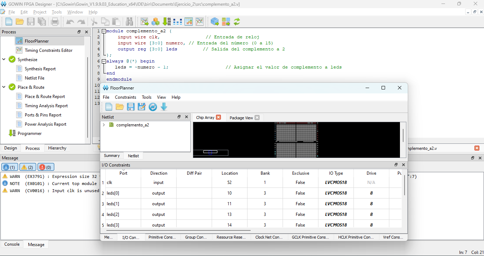
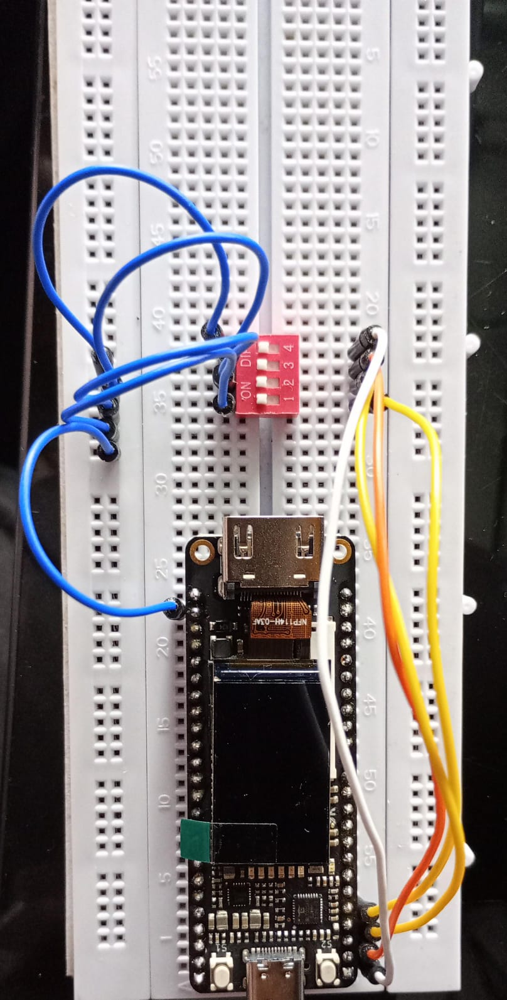

### Ejercicio 2. Switches, botones y LEDs
1. Diseñe un módulo que reciba como entradas los 4 interruptores hacia los pines de la FPGA que se utilizará en este laboratorio.
2. Las salidas del módulo se mostrarán en los 4 LEDs disponibles en la tarjeta de desarrollo.
3. El bloque a desarrollar debe convertir el código ingresado por los interruptores por el correspondiente a su complemento a 2 hacia los LEDs.
4. Implemente un banco de pruebas (testbench) para validar el funcionamiento de su diseño.
5. Realice una validación de su diseño en la tarjeta con FPGA.
## Planteamiento del problema
Para este caso se busco una forma en como designar que la salida de en los 4 bits, para este buscamos que a través de una compuerta nor y un sumador de un bits. Para esto antes de establecerlo en el programa verilog, establecemos la siguiente tabla de verdad.
*Respuesta:*
# Tabla de verdad de nuemros de 4 bits a su complemento a2.
| NUMERO binario | Complemento a2 | Hexadecimal  |
|----------------|----------------|--------------|
|   A  B  C  D   | A'  B'  C'  D' | A  B  C  D   |
|----------------|----------------|--------------|
|   0  0  0  0   |   0  0  0  0   | 0  0  0  0   |  
|   0  0  0  1   |   1  1  1  1   |     F        | 
|   0  0  1  0   |   1  1  1  0   |     E        | 
|   0  0  1  1   |   1  1  0  1   |     D        |
|   0  1  0  0   |   1  1  0  0   |     C        |        
5|   0  1  0  1   |   1  0  1  1   |     B        |
|   0  1  1  0   |   1  0  1  0   |     A        |
|   0  1  1  1   |   1  0  0  1   | 1  0  0  1   |
|   1  0  0  0   |   1  0  0  0   | 1  0  0  0   |
|   1  0  0  1   |   0  1  1  1   | 0  1  1  1   |
|   1  0  1  0   |   0  1  1  0   | 0  1  1  0   |
|   1  0  1  1   |   0  1  0  1   | 0  1  0  1   |
|   1  1  0  0   |   0  1  0  0   | 0  1  0  0   |
|   1  1  0  1   |   0  0  1  1   | 0  0  1  1   |
|   1  1  1  0   |   0  0  1  0   | 0  0  1  0   |
|   1  1  1  1   |   0  0  0  1   | 0  0  0  1   |

Aclaramos que al trajar con vivado es mejor manerjar los datos en sistema hexadecimal, de igual forma se evita las largas listas de numeros. 
Ahora de esta manera conocemos como se debe de comportar el sistema a la hora de programarlo en vivado.
## Codigo de prubas en vivado.
Antes de subir el archivo a la tarjeta Tang Nano 9k, se debe realizar una prueba, está se realizó en Vivado, dicho codigo está  [Codigo prueba.sv](Codigo_prueba.sv). De manera que comprobamos su funcionamiento a través de un banco de pruebas, este se visualiza en el siguiente codigo  [Codigo prueba testbench.sv](Codigo_prueba_tb.sv), al realizar está prueba se debera ver una entrada de 4 bits que contiene el interruptor, los cuales van de 0 a F, ya que se trabaja en nomeclatura hexadecimal. De está forma los 4 leds de la tarjeta deberan dar como resultado la cuenta de los números en complemento a 2, es decir acorde a la formula ~(número)+1'b. En la siguiente imagen podemos ver que se cumple los resultados. 

## Implementación en tarjeta. 
Ya con el codigo pasado por las pruebas lo pasamos a un programa para subirlo a al tarje Tang Nano 9k, en este caso se utilizó GoWin. El codigo se cambia al siguiente [Codigo_a_subir.v](Codigo_a_subir.v), y se determian que los pines a usar son para las luces led 10,11,13,14 (deacuerdo a la hoja de datos de la tang nano 9k), para las entradas 38,37,36 y 39.

Ya el circuito montado se ve de la siguiente manera.
.
Anotación cables azules corresponde a tierra.
## Pruebas en la tarjeta.
Para este caso se van a implementar cuatro prubas de los nuemro 1,5,11,15, los cuales sus resutltados se visualizan en la sigueintes video. 
# Video de realización de las pruebas.
Se incia con la señal cero, pasa a señal 1 que da su complemento F, para señal 5 pasa 11, en señal 11 pasa a su complemento a 2 que es 5 y poe ultimo si todos están activos, solo el primer led se enciende (uno logico).
[Video demostración](./prueba.mp4)

