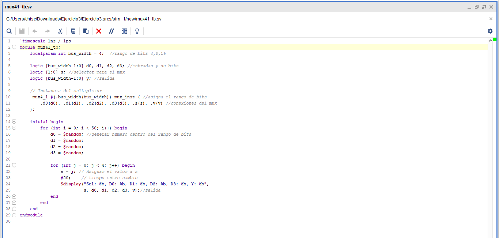
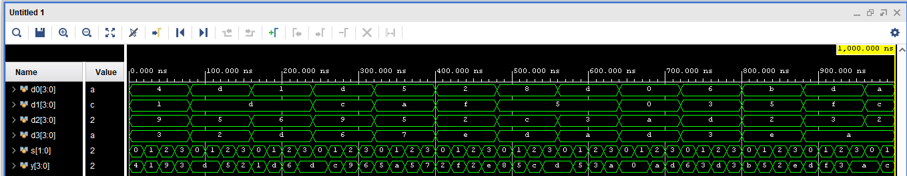
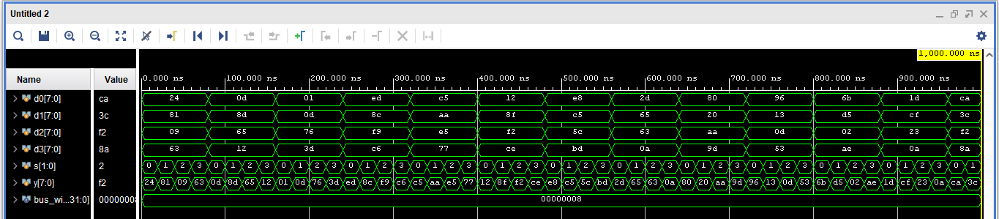

### Ejercicio 3. Multiplexor 4-to-1
1. Dise˜ne un multiplexor de cuatro entradas, parametrizado, para un ancho de datos (bus
width) de entrada y salida variable.
2. Realice un banco de prueba (testbench) en el que se muestre de manera simple el funcionamiento del multiplexor. Muestre el resultado de la prueba para anchos de datos de 4, 8
y 16 bit, para los cuatro selecciones de entrada y para al menos un conjunto de datos de
entrada de 50 datos en cada caso.
3. Ejecute su prueba y aseg´urese de que todos los errores y las advertencias producidas por la
simulaci´on hayan sido debidamente atendidas y corregidas.

## Plantamiento del problema
Se visualizó el como se puede estabelcer un mux parametrizado de manera que se puda incluir el bus_wicth, como maximo para las pruebas se establecio un maximo de 16 bits. Es decir, tenemos que realizar tres pruebas para 4 bits, 8 bits y 16 bits. 

## Codigo de pruebas en vivado 
Antes de subir el archivo a la tarjeta Tang Nano 9k, se debe realizar una prueba con el maximo de bits que corresponde a 16 bits, se aclara que este es el maximo por defecto pero en las pruebas se asocia a cada banco de bits estimados, está se realizó en Vivado, dicho codigo está [Codigo_mux.sv](codigo_mux.sv), al realizar está prueba se debera ver una entrada de 4 bits que contiene el interruptor. De está forma los 4 leds de la tarjeta deberan de asosiar la salida dada por los interruptores en sus terminales leds de la propia tarjeta. Otra observación es que se puede presentar ruido o señales erroreas dado a la cantidad de jumpers que ocupara este problema.
## Pruebas del codigo en viviado
Para esta sección se mostrara cuatro pruebas del codigo donde se parametrizaran dichos bus_wicth.

Posterior de esta forma se realizo el testbech. 

# Prueba con 4 bits
En este caso tenemos la prueba con el minimo de bits posibles en las entradas que corresponde a 4 bits. Anotación para las diferentes pruebas no se verán cambios en el codigo_mux.sv.

Como podemos ver en este caso se mantiene los parametros de 4 bits en las entradas y el mux esta realizando su funcion de selección de datos para la salida.

En este caso se aumenta el numero de bits permitidos por lo que podemos ver cantidades más grandes en sus terminales. Como una anotación el tiempo para cumplir las 50 repeticiones se aumento.

Por ultimo tenemos los resultados con el maximo de bits posibles, para este caso se tiene que aumentar el tiempo dado que al ser tantas variaciones en poco periodos no se logran ver. 
Se puede determinar que el mux parametrizados, nos da una utilidad en caso donde se conoce con que valores se van a trabajar y como este nos puede reducir o especificar los periodos de trabajo. 

