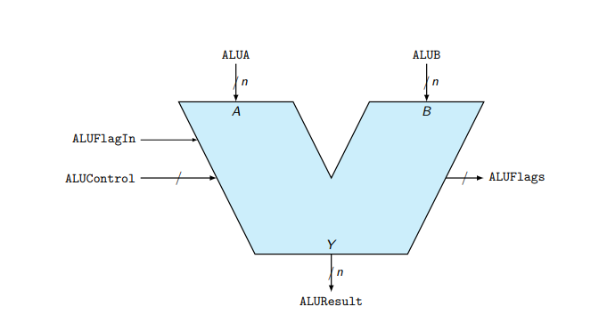
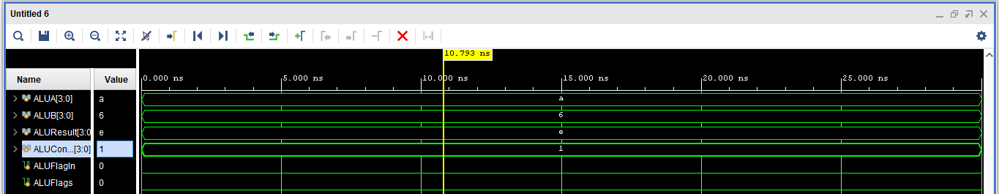
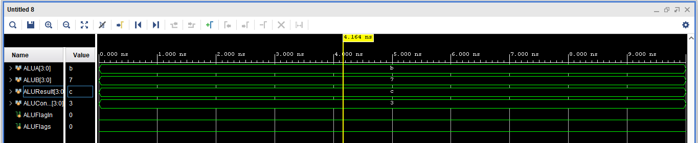
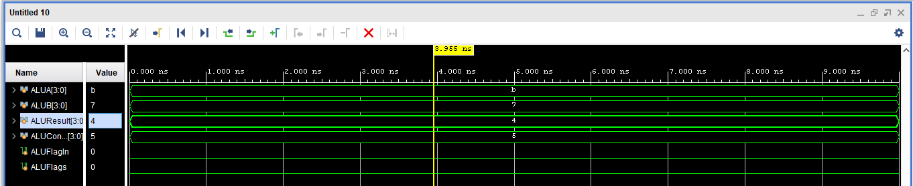
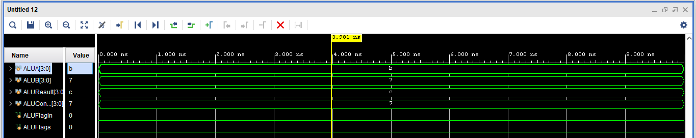
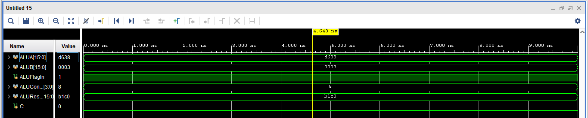
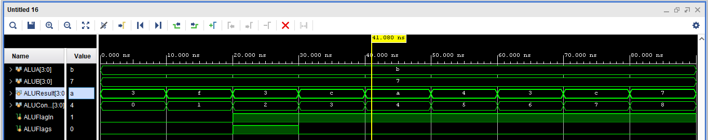

### Ejercicio 5. Unidad aritmética lógica (ALU)
En este ejercicio deberá diseñar una ALU parametrizable de n bits, como se muestra en la Figura 2.
Dicha unidad deberá tomar dos números de n bits como entrada, así como un bus de control,
denominado ALUControl, que debe permitir seleccionar cuál de las operaciones aplicar. Debe
respetar los nombres indicados en la figura en la interfaz de su módulo. Las diferentes operaciones
que debe realizar la ALU (incluyendo su código de operación en hexadecimal) son:
0h - and,
1h - or,
2h - suma (en complemento a dos),
3h - incrementar en uno el operando
4h - decrementar en uno el operando
5h - not (sobre un operando),
6h - resta (en complemento a dos),
7h - xor,
8h - corrimiento a la izquierda del operando A, y
9h - corrimiento a la derecha del operando A.

## Funcionamiento de la ALU
La bandera de entrada ALUFlagIn representa el acarreo de entrada para la suma y resta, o el
bit de entrada en los corrimientos hacia la izquierda o derecha. Su función es permitir conectar
2 ALU para proveer el doble del número de bits en estas operaciones. En las operaciones de
negación, incremento y decremento, esta bandera selecciona cuál de los operandos utilizar (0
debe seleccionar al operando A y 1 al operando B). En el resto de operaciones lógicas, esta señal
es ignorada.
Para las operaciones de corrimiento a la derecha o la izquierda, el operando a desplazar es siempre
dado por A y cuántos bits a desplazar es siempre dado por B. La bandera ALUFlagIn indica con
que valor deben rellenarse los nuevos bits introducidos, y la bandera de salida C indica cual fue
el “último” bit que salió de la ventana representada.
Por ejemplo, para una ALU de 8 bit, si A = 1101 01102, y B = 0000 00112, ALUFlagIn = 1,
entonces, en un desplazamiento a la izquierda el resultado es Y = 1011 0111, con C = 0, mientras
que para un desplazamiento a la derecha el resultado es Y = 1111 1010 con C = 1.
Adicionalmente la ALU deberá generar una bandera de resultado Cero (Z). Dicha bandera es uno
si el resultado es cero independientemente de la operación lógica o aritmética seleccionada.
## Imagne de un diseño de la ALU

## Ejercicio
1. Diseñe la ALU con un modelo utilizando Verilog. Parta de los circuitos básicos (sumadores,
restadores, de corrimiento, etc.) que considere necesarios. Muestre los diagramas de bloques,
tablas de verdad y circuitos de cada módulo en el diseño.
2. Realice al menos un testbench de auto-chequeo, usando SystemVerilog, en el que se muestre
de manera simple el funcionamiento completo de la ALU en 4 bits. Las pruebas deben ser
elaboradas de manera aleatoria.

## Plantamiento del problema
Para este problema se reviso la bobliografía vista en el cursod de diseño lógico, se consulto el libro Digital Design and Computer Architecture, donde se presenta una sección que explica el funcionamiento de las ALU. Como lo dice la ALU, es una combinación de variables matematicas  y lógicas operacionales. (1), para este caso se tiene un parametro de N-bits, por lo cual se debe de trabajar bajo este proceso. Por lo cual las entradas A y B, tiene que estar dentro de este parametro. Para el control de la operaciones podemos basarme en la siguiente tabla.
# Tabla de operaciones de la ALU

| ALU       |                |
|-----------|----------------|
|  F (2:0)  | Funciones      |
|-----------|----------------|
|  0  0  0  |   A  AND   B   |
|  0  0  1  |   A  OR    B   |
|  0  1  0  |   A   +   ~A   |
|  0  1  1  |   A   +    1   |
|  1  0  0  |   A   -    1   |
|  1  0  1  |   A  NOT   B   |
|  1  1  0  |   A   -   ~A   |
|  1  1  1  |   A  XOR   B   |

En este caso las funciones de mover a la derecha y a la izquierda no se considera funciones sino un comando para moverse por el los bits de acuerdo al diseño que se propone en el enunciado.

## Diseño del circuito Aly

Como podemos ver esta ALU, realiza los desplazamientos, como tanbién recibe las señales de A y B para determianr por medio de comprueabas lógicas realiza los calculos, todo esto lo recibe la mux que designa las salidas y las banderas de carry o de overflow. 
## Codigo en vivado
Ahora sabiendo como se va a trabajar realizamos una estructura en vivado por medio del lenguaje de systemverilog. [Codigo ALU](ALU.sv).
Como se puede ver el codigo tiene tres parte la función del desplazamiento de derecha o izquierda, luego se pasa a las funciones de operaciones y por ultimo las banderas de salida para determianr carreos y control. 

## Prueba por medio de la simulación de la ALLU.
Trabajaremos con el siguiente test bench, para realizar las pruebas de la ALU.
[Testbench ALU](ALU_tb.sv).

# Prueba 1. AND
Se realizó dos pruebas con dos numeros diferentes, 12 and 7 es 3 mientras que 15 and 1 es 1. Por lo que en elcaso de un AND la ALU funciona correctamente.

# Prueba 2. OR
Se realizó una prueba para comprobar la compuerta OR, donde a OR 6 da e. Para facilitar se trabaja con numero hexadecimales ya que recordemos que la ALU es parametrizable. 

# Prueba 3. suma complemento a 2
En este caso no esta mal la suma ya que su valor final corresponde a su complemento a 2, por lo cual funciona el intercambio de valor.

# Prueba 4. suma +1
Aquí si es una suma del valor A +1 como se muestra en la imagen.

# Prueba 5. resta -1
Resta de uno en el valor que incresa en el intervalo A

# Prueba 6. NOT
Calculamos una not entre los valores de A y B vemos que la compuerta funciona como se muestra en la siguiente imagen.

# Prueba 7. resta complemento a 2
Misma funcion de complemento a 2 pero en este caso se resta.

# Prueba 8. XOR
Si realizamos el calculo de una XOR entre al A=b y B=7, nos da en resultado hexadeciaml de c.

# Prueba 9. Derecha o izquierda
Aquí realizamos un ejemplo propio con los valores de A y B que ya veniamos trabajando, como vemos según el valor de A se mueve la cantida de bits como vemos pasamos a un valor 4'b1011 a un valor 4'b0110, como se muestra en el primer franco de la imagen para el siguiente caso que va a la derecha pasa de 4'b1011 a 4'b0101. De manera que cumplimos con lo solicitado en el enunciado. Y lo comprobamos en la imagen. 

## Prueba del desplazamiento del enunciado 
Como vimos hicimos pruebas por cada una de las operaciones que debe realizar la ALU, pero en el enucniado viene con un ejemplo de como debe de funcionar dicho operador, por lo tanto a continuación se muestra como nuestra ALU prueba esta condiciones y cumple con lo requerido. 

### Concluciones
Para este problema establecemos como conlcucion que el parametrizar una ALU, delimita su funcionamiento ya que conceremos la entrada de bits, por lo cual en caso de bancos de bits pequeños nos limpia los resultados, por otro lado el tener dos ALU conectados, dublica la cantidad a trabajar de estos bancos, sin generar circuitos más complejos.
Por ultimo los flancos de bandera son muy importantes para concer como esta tabajando, si exite un carreo de datos, o si se tiene más bits de los nesesarios, también se puede colocar banderas de errores o de resultados los cuales en un código más complejo nos puede ayudar a evitar confunciones. 

## Prueba total de la ALU.
En la siguiente imagen se podra ver la ALU, con todos los resultados en un solo testbench para analizar.

# Bibliografía.
1.David Money Harris y Sarah L. Harris. Digital Design and Computer Architecture, RISC-V Edition. San Francisco, CA, USA: Morgan Kaufmann Publishers Inc., 2022. ISBN: 978-0-12- 820064-3.